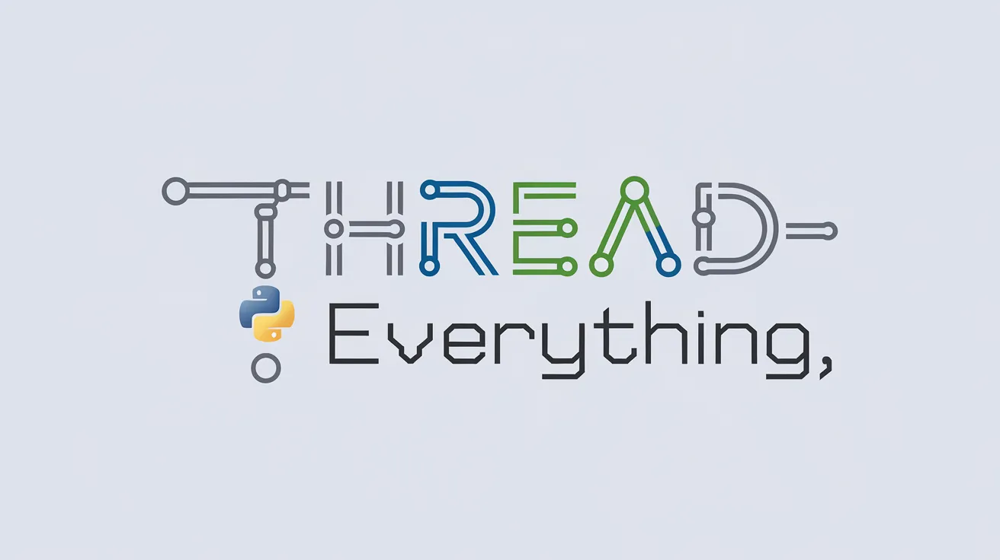

Thread-Everything: 一个简单易用的跨平台多端通信工具
==================================================
[](https://github.com/sergiudm/detectivePi/actions/workflows/mkdocs.yml)
[](https://github.com/sergiudm/detectivePi/actions/workflowstest.yml)
[](https://pypi.org/project/Thread-Everything/)

## 介绍

[Thread-Everything](https://sergiudm.github.io/Thread-Everything/) 提供了易用的 Python API,同时运行*不同*主机上的任何线程，支持Windows, Linux, 可在X86, ARM主机上运行。



通过Thread-Everything，你可以轻松地把你的功能部署到不同的主机上，实现多机通信。Thread-Everything提供了一套插件机制，你可以根据自己的需求[编写插件](https://sergiudm.github.io/Thread-Everything/plugins-tutorial/)，实现不同的功能，
例如：
- 使用单个 Windows 客户端控制远程机器人。
- 基于手势识别的在线动作游戏。
- 智能KTV（手势切歌、氛围灯等）。
- 通用GPIO调度器，零代码配置GPIO电平，秒杀大学里各种Lab作业。

## 架构
```mermaid
graph TD
    subgraph "Resource Manager"
        C[config.json]
        C-->P[Assets Loader]
    end

    subgraph "Core Components"
        B(Plugin Manager) -- loads--> C
        B --> D[Runner Engine]
        D --> E[State Machine]
        D --> N[Vision Engine]
        D --> F[Music Engine]
    end

    subgraph "Plugins (modules)"
        F --> G[Music Player]
        D --> J[Other User Defined Plugins] 
        N --> H[Body Feature Extractor]
        N --> O[Gesture detector]
        E --> I[GPIO Controller]
    end
    
    subgraph "Communication Module"
      D --> K[Socket Module]
      D --> L[Mailbot]
      K <--> M[Other Machines]
    end

   

    style B fill:#336,stroke:#ccc,stroke-width:2px
    style D fill:#363,stroke:#ccc,stroke-width:2px
    style G fill:#663,stroke:#ccc,stroke-width:2px
    style H fill:#663,stroke:#ccc,stroke-width:2px
    style I fill:#663,stroke:#ccc,stroke-width:2px
    style J fill:#663,stroke:#ccc,stroke-width:2px
    style O fill:#663,stroke:#ccc,stroke-width:2px
    style K fill:#336,stroke:#ccc,stroke-width:2px
    style L fill:#336,stroke:#ccc,stroke-width:2px
```
本项目的核心模块是一个插件调度器，它负责加载插件并调度插件的执行。插件是一个独立的 Python 模块，它可以实现一些特定的功能，如控制GPIO电平、面部识别等。插件调度器会根据一个统一的配置文件控制插件的加载和执行。插件调度器是一个非常灵活的框架，用户可以根据需求自定义插件的功能。我们提供了视觉后端引擎、音乐引擎和状态机来简化插件的开发。基于现有框架，本项目实现了音乐播放器、手势识别、坐姿检测、GPIO切换器这几个插件。另外，这些功能还可通过通信模块实现P2P通信。

## 运行环境
| 环境   | 版本                         |
| ------ | ---------------------------- |
| OS     | Ubuntu22.04, Raspberry Pi OS, Window11, Debian 12|
| Python | 3.10                         |

## 安装
## pip安装
```bash
pip install Thread-Everything
```

## 源码安装
克隆仓库
```bash
git clone https://github.com/sergiudm/Thread-Everything.git
cd detective
```
你可以使用`deploy.sh`脚本自动安装
```bash
sudo chmod +x deploy.sh
./deploy.sh
```
或者手动安装
```bash
conda create -n <your_env_name> python=3.10
conda activate <your_env_name>
pip install -r requirements.txt
```

## 使用说明
开始前，你需要配置在项目根目录创建一个`config.json`文件，
以下是一个示例，完整的配置文件请参考`config_template.json`。
```json
{
    "use_pi": false,
    "plugin_list": [
        "information_server",
        "GPIO_controller",
        "music_server",
        "gpio_controller",
        "gesture_detection",
        "meditation_helper",
    ], # 注意：涉及GPIO的插件要开启`use_pi`，如果不使用GPIO相关的库则关闭
    "use_camera": true,
    "use_visualization": false, # 是否使用可视化
    "server_email": "youremail@example.com",
    "server_email_password": "your email password",# 请使用授权码
    "target_email": [
        "email1",
        "email2"
    ],
    "smtp_server":"your smtp server",
    "smtp_port": 587,
    "video_path": "assets/videos/sit.mp4", # use_camera为false时，使用该视频
    "image_path": "resources", # 邮件中的图片
    "send_delay": 13,
    "effective_detection_duration": 2,
    "max_num_hands": 2,
    "min_detection_confidence": 0.65,
    "min_tracking_confidence": 0.65,
    "pin_data": {
        "pin_list": [
            17,
            23,
            24,
            25,
            27
        ],
        "pin_map": {
            "Right": [
                17,
                23,
                24
            ],
            "Return": [
                23,
                24
            ],
            "Left": [
                17,
                24
            ],
            "Pause": [],
            "Like": [
                25
            ],
            "OK": [
                27
            ]
        }
    }
}
```
>[!CAUTION] 
实际使用时，请删除`config.json`中的所有注释!

Linux:
```bash
sudo chmod +x run.sh
./run.sh
```
Windows:
```bash
./win_run.bat
```

## 功能
根据你的需求，你可以在`modules`目录下定义自己的插件，我们已经实现了一些插件，包括：
- 手势检测
    - 开启手势线程之后，计算机使用搭载的摄像头捕捉图像信息，并分析画面中的手势，如“OK”、“赞”等。
    - 可以将识别到的手势信息通过通信模块发给多个目标主机。
- 姿势检测
    - 开启姿势线程之后，计算机使用搭载的摄像头捕捉图像信息，并分析画面中的人体姿势，如“sitting”、“slouching”等。
    - 会反馈当前的姿势信息。
- 音乐控制
    - 音乐线程可以控制设备上的音乐流，如播放模式、音量、播放与暂停等。
    - 该线程需要信息的输入，如：通过命令行输入、手势线程的输入。 
    - 将音乐文件放入指定路径，音乐线程即可自动控制。
- 通用GPIO控制器
    - GPIO控制线程只能在树莓派上使用，用于控制GPIO引脚的电平。
    - 该线程需要信息的输入，如：通过命令行输入、手势线程的输入。
- 个性化邮件发送
    - GPIO控制线程只能在树莓派上使用，用于控制GPIO引脚的电平。
    - 该线程需要信息的输入，如：通过命令行输入、手势线程的输入。


## 应用场景举例
Thread-Everything具有高度的可扩展性，可以应用于多种场景。基于现有的插件，我们打造了以下应用：

- 基于视觉识别的打坐助手
    - 应用场景的假设：修行者打坐时不希望被外界干扰，如电话、微信等。现阶段的计时器需要使用手机或者闹钟进行接触式的时间设定，而且对于初学者，无法得知自己的姿势是否正确。使用Thread-Everything 视觉引擎实现的打坐助手可以进行无接触式的时间设定与姿势校正提示。
    - 用户使用手势设定打坐时间，并进行打坐。
    - 打坐过程中，树莓派（或Windows）会使用摄像头监控人体姿势，如发现姿势不正确，就会亮灯提醒（可自己配置），并且结束时会通过邮件发送不正确姿势的照片，提醒用户校正姿势。
  - <div style="text-align: center;">
        
    </div>

- 智能健身房：步频检测、BGM控制
  - 通过引体向上的动作控制健身房BGM以及光效等炫库操作。
  - 检测到人跑步或者椭圆仪运动会计算步频（基于视觉，比手表更准确）。
  - 运动结束后，会自动发送运动报告邮件，包含运动快照、最高步频等信息。
  - 运动时，用户可以通过手势对音乐流进行操作，如：切歌、播放与暂停等。
  
<div style="display: flex; justify-content: space-around;">
    
    
    
    
</div>

- 反卷中心APP
   - 检测寝室夜晚内卷的室友，自动发送邮件提醒。让你的室友不再内卷。
- <div style="text-align: center;">
    
</div>

## 后续工作

- 核心模块
  - 完善视觉后端引擎
    - 目前的视觉引擎完全基于[mediapipe](https://github.com/google-ai-edge/mediapipe)，我们希望后续提供一个通用的视觉处理模块，支持不同的视觉库和自定义算法。

  - 集成语音处理模块
    - 新增一个简单的语音处理模块，便于远程呼叫、语音输入等插件的开发。
  - GPIO控制器
    - 完善GPIO控制器，支持更丰富的GPIO操作，如PWM、I2C等。

## 如何贡献
- 添加更多[插件](https://sergiudm.github.io/Thread-Everything/plugins-tutorial/)
- 提交issue

## Acknowledgement
- [mediapipe](https://github.com/google-ai-edge/mediapipe)

- [cv2](https://docs.opencv.org/4.x/index.html)

- [pygame](https://www.pygame.org/docs/)


